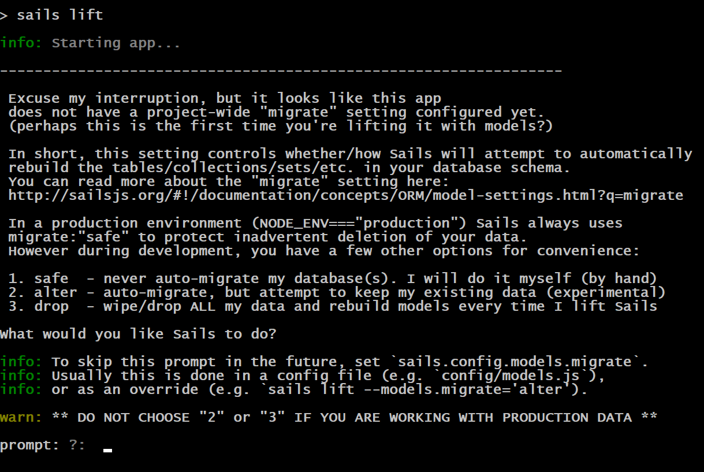
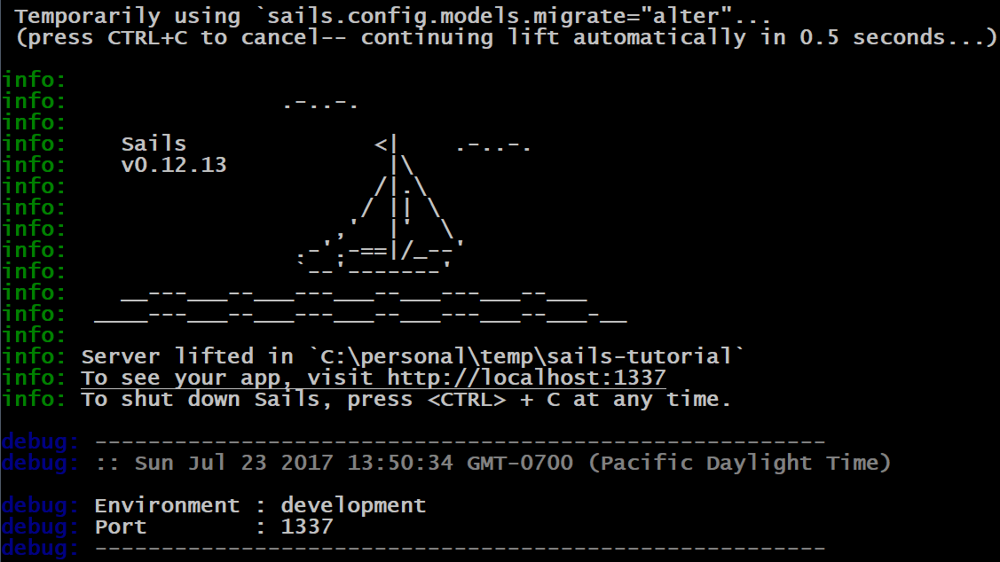

## Generating Api

Now that we have generated our project, before we can use it, we need to generate an Api.  Our Todo API will have two APIs:  User and Todo.  We will use the Sails CLI to generate the APIs.  

When you generate a new api it will create a model and controller for the API.  A model describes the data store fields with attributes such as type, required, unique, and defaultsTo.  The controller will contain our functions that are related to the model.  

Out of the box, Sails wires up all of the REST verbs (GET, POST, PUT, DELETE) for us and saves the data to a schema-less JSON file as the data store.  This means that immediately after running the generate command we can use the API without having to write any code. 

### Generating User API

<h4 class="exercise-start">
  <b>Exercise</b>: Generating User API
</h4>

1. Visual Studio Code has a built-in terminal that we can use to run our commands.  Open up the integrated terminal in Visual Studio Code  by using ctrl+` or view menu -> Integrated Terminal
1. Run the following command to create the user API

    ```bash
    sails generate api user
    ```

1. This will create 2 files for us:

    * api\controllers\UserController.js
    * api\models\User.js

<div class="exercise-end"></div>

### Generating Todo Api

<h4 class="exercise-start">
  <b>Exercise</b>: Generating Todo API
</h4>

1. In the Visual Studio Code integrated terminal (ctrl+` or view menu -> Integrated Terminal), run the  following command to create the user API

    ```bash
    sails generate api todo
    ```

1. This will create 2 files for us:

    * api\controllers\TodoController.js
    * api\models\Todo.js

<div class="exercise-end"></div>

### Running Api

<h4 class="exercise-start">
    <b>Exercise</b>: Starting Api
</h4>

1. In the Visual Studio Code integrated  terminal run the following command to start our API

    ```bash
    sails lift
    ```

    

    <div class="alert alert-danger" role="alert">You will notice that you are prompted with a big long question about database migration strategy to use.  Sails does not make any assumptions on how we want it to deal with database migrations as the models are updated.  Out of the box Sails uses a schema-less JSON file as the data store.  This is what allows us to immediately started working with our API.  Until we set the database migration strategy to use, we will be prompted to select one when we run sails lift.</div>

1. When prompted for the migration strategy, type 2 and press enter

        

    <div class="alert alert-info" role="alert">You will see that a message shows up that says "Temporarily using sails.config.models.migrate="alert"..."</div>

1. The API is now started up and we are ready to do some testing with Postman

<div class="exercise-end"></div>